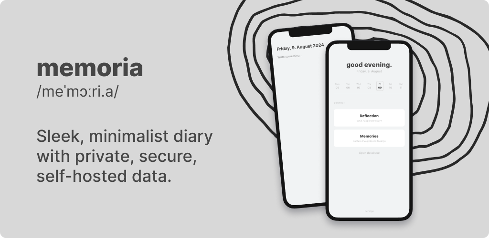

# memoria — private journal

Frustrated with endless subscriptions and the unpredictability of closed-source apps? Longing for a diary that is as private as it is stylish? **memoria** offers a minimalist, modern design where your data remains with you — no analytics, no tracking, and fully self-hostable. You can trust that your diary will stay accessible and secure, thanks to its open-source nature, which ensures that your memories are protected and the app remains reliable over time.

- **Offline First Approach:** Enjoy full functionality without needing an internet connection.
- **Optional Sync:** Seamlessly sync your data with a self-hosted server, only if you choose to.
- **No Registration Required:** Start using the app instantly — no account creation needed.
- **No Tracking:** Your data remains your own — no tracking, ever.
- **Biometric Login:** Quickly and securely access your app with biometric authentication.
- **No Distraction:** A clean, minimalistic interface that helps you stay focused on what matters.

## Installation

<div align="center">
  <a href="https://play.google.com/store/apps/details?id=de.xp4u1.memoria">
    
  </a>
  <a href="https://apps.apple.com/us/app/memoria-private-journal/id6621187886">
    
  </a>
</div>

<br />

With the following steps, you can start **memoria** locally on your own computer:

```
# Clone repository
$ git clone git@github.com:xp4u1/memoria

# Install dependencies
$ yarn

# Start development server
$ yarn dev
```

You can now access **memoria** in your browser at `http://localhost:5173`.

## Is it free?

Yes, **memoria** is free software, licensed under the AGPL-3.0.

You can download the latest Android version from the [releases tab](https://github.com/xp4u1/memoria/releases) on GitHub at no cost. This is perfect for testing the app or if you're unable to make a purchase. However, please note that this version doesn't include automatic updates.

With that in mind, I would greatly appreciate it if you would **consider purchasing the app** on [Google Play](https://play.google.com/store/apps/details?id=de.xp4u1.memoria) or the [App Store](https://apps.apple.com/us/app/memoria-private-journal/id6621187886), if you're able. Your one-time payment helps cover development expenses, app marketplace fees, and supports the ongoing growth of the project. Your support is essential for maintaining and enhancing **memoria**.

## Synchronization Server

The app supports synchronization with any CouchDB-compatible databases, which can be either self-hosted or rented from a cloud provider.

In the [`./database`](./database) directory, you will find a sample configuration for a Docker installation.

Due to security policies enforced by modern Android and iOS platforms, the database address must meet the requirements for a [secure context](https://developer.mozilla.org/en-US/docs/Web/Security/Secure_Contexts). This means the database must be accessible via a secure web request (HTTPS). Consequently, addresses within a home network are not supported.
